# iOSプロジェクトの作成
Xcodeで適当なbundle identifierを持つ適当なプロジェクトを作成してください。  
(既存のプロジェクトと被らないようなbundle identifierで)
Xcodeのプロジェクト作成完了後、`git init`で初期化してください。  


# fastlaneのセットアップ
## ruby環境の構築(必要に応じて)
fastlaneを動かすruby環境を構築するために、rbenvを利用します。

```
$ brew install rbenv
$ brew install ruby-build
```

rbenvにパスを通すために、
`~/.bash_profile` に以下を追記します。

```
export PATH="$HOME/.rbenv/bin:$PATH"
eval "$(rbenv init -)"
```
`~/.bash_profile`を再読込し、  
rubyの2.3.1をインストール、  
それから、現在のディレクトリのrubyバージョンを2.3.1で指定します。
```
$ source ~/.bash_profile
$ rbenv install 2.3.1
$ rbenv local 2.3.1
```

## gemのインストール
今回必要なgemをGemfile.lockからインストールするために、  
Bundlerをインストールします。
```
$ gem install bundler
```

bunlderがインストールされたので、Gemfile.lockから
今回必要なgemをインストールします。

```
$ bundle install --path vendor/bundle
```

# iOSプロジェクトへのfastlaneの適用
## match用のリポジトリを作成
matchが生成・更新・管理する証明書やProvisioning Profileを格納するためのリポジトリを作成します。  
証明書、Provisioning Profileを格納するため、
# **絶対にPrivateであることを確認してください。**

## fastlaneのセットアップ
`bundle exec fastlane...`を実行する度にAppleIDやbundle identifierを何度も入力するのが面倒なので、このタイミングで`fastlane init`を実行し、Appfileを生成するようにします。
```
$ bundle exec fastlane init
```

## iOSプロジェクトのディレクトリでmatchのセットアップ
一番最初に作成したiOSプロジェクトのディレクトリでmatchを使用する準備を行います。
```
$ bundle exec fastlane match init
```

これにより、証明書、Provisioning Profileの更新があった際に  
match用のリポジトリに証明書、Provisioning Profileがpushされるようになります。

## matchで証明書、Provisioning Profileの作成
準備が整ったので、以下のコマンドでAdHoc用の証明書、Provisioning Profileを作成します。  
このタイミングで証明書、Provisioning Profileを暗号化するためのpassphraseを入力しますが、これはCircleCI上でファイルを復号する際に必要になりますので、忘れないようにしてください。
```
$ bundle exec fastlane match adhoc
```

これを実行することで、Apple Developer Center上に証明書とProvisioning Profileが作成され、  
Keychain Accessにも秘密鍵、証明書が取り込まれた状態になります。

## matchを利用してipaを生成するlaneの作成
`bundle exec fastlane init`で生成されたFastfileについて、以下の内容のみを残すように編集します。  
また、Auto Signingが有効になっていると、コマンドライン経由でのアーカイブに失敗するため、このタイミングでAuto Signingをオフにしておきます。
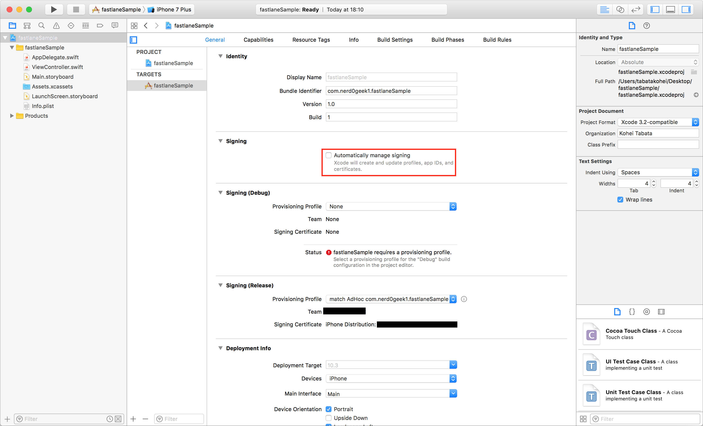

```
default_platform :ios

platform :ios do
  desc "Runs all the tests"
  lane :test do
  end

  desc "distribute latest app ipa via DeployGate"
  lane :beta do
    // AdHoc用の証明書、Provisioning Profileをダウンロード、インストール
    match(type: 'adhoc')
    // AdHoc用のipaファイルをビルド
    gym(export_method: 'ad-hoc')
  end
end
```

ローカルで以下を実行し、処理が成功することを確認します。
```
$ bundle exec fastlane beta
```
# CircleCIへのデプロイ
## CircleCIへのデプロイを準備
fastlaneをCircleCI上で実行するための準備を行います。

### ビルドイメージをUbuntuからOS Xに変更
CircleCIでは、Ubuntuがデフォルトのビルドイメージになっていますので、まずこれをOS Xに変更します。
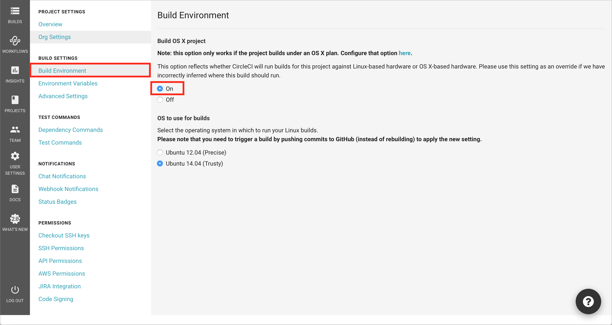

### circle.ymlをセットアップ
次にcircle.ymlを作成し、以下の内容を記述します。
```
machine:
  xcode:
    version: '8.3.3'
  environment:
    override:
    LANG: en_US.UTF-8
dependencies:
  cache_directories:
    - 'vendor/bundle'
  override:
    - bundle install --path vendor/bundle
test:
  override:
    - bundle exec fastlane test
deployment:
  deploygate:
    branch: master
    commands:
      - bundle exec fastlane beta
```

### CircleCIの環境変数をセットアップ
fastlaneをCI環境で利用する際に必要になる以下の環境変数を設定します。
- MATCH_PASSWORD  
(暗号化した証明書、Provisioning Profileの復号のために必要)
- FASTLANE_PASSWORD  
(matchが必要に応じてiOS Developer Centerにアクセスするために必要)
- MATCH_KEYCHAIN_NAME  
(CircleCI特有。CircleCIがデフォルトのkeychainを`circle.keychain`としているため、`circle`と設定する必要がある。)
- MATCH_KEYCHAIN_PASSWORD  
(keychainのパスワード。CircleCIの場合は`circle`)
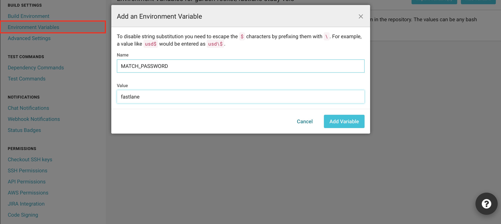

## user keyの設定
通常、CircleCIなどのCIサーバから複数のプライベートリポジトリへのアクセスは許可されていません。  
そのため、user keyを設定し、ホスティングサービスののユーザーとして複数のプライベートリポジトリへのアクセスを可能にします(2つのリポジトリに対してread権限のみを持つユーザーが望ましいです)

### GitHubの場合
各プロジェクトの編集画面(歯車のアイコン)を選択し、プロジェクト編集画面へ遷移  
→`PERMISSIONS > Checkout SSH keys`を選択し、`Authorize with GitHub`をクリック
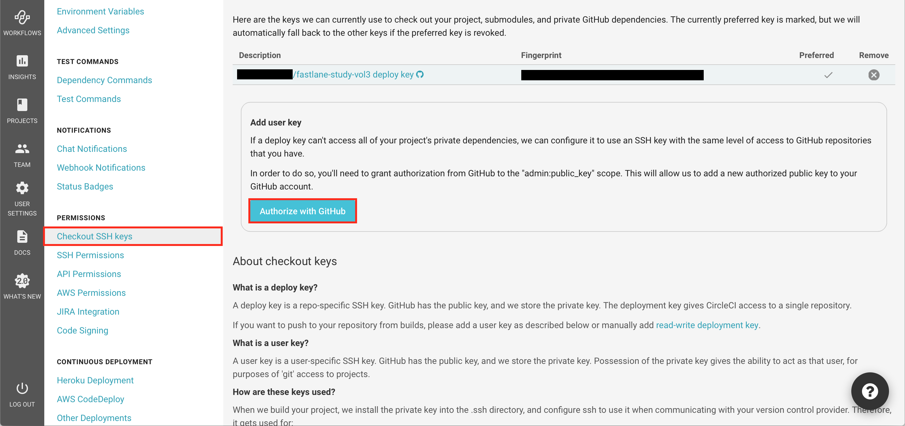

`Create and add USERNAME user key`をクリック
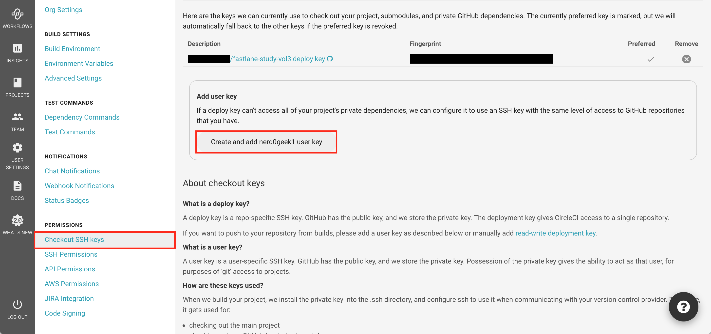

user keyが追加されたことを確認
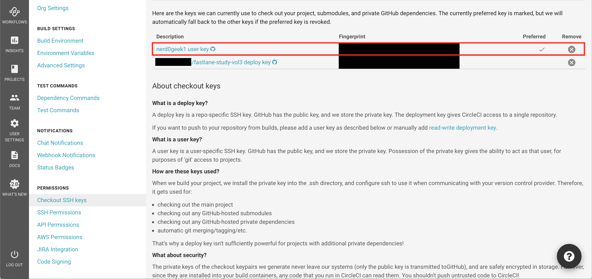

ここまで完了した段階でビルドを実行すると、CircleCI上で.ipaファイルが作成できるようになっていると思います。

### Bitbucketの場合
各プロジェクトの編集画面(歯車のアイコン)を選択し、プロジェクト編集画面へ遷移  
→`PERMISSIONS > Checkout SSH keys`を選択し、画面を右クリック  
`Inspect Element`を選択
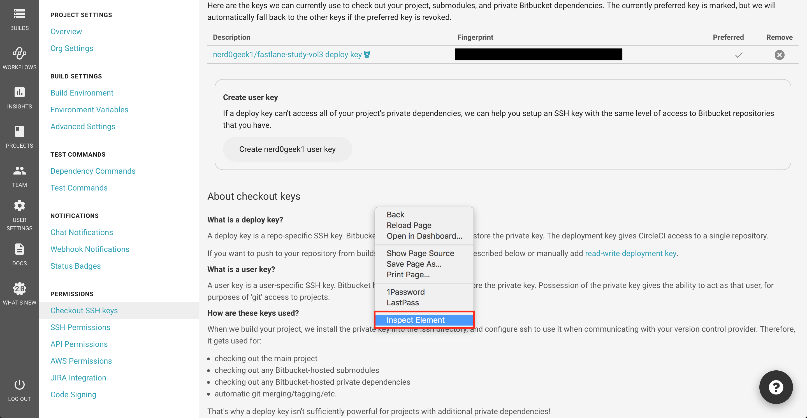

Networkタブの選択後、`Create Username user key` をクリック
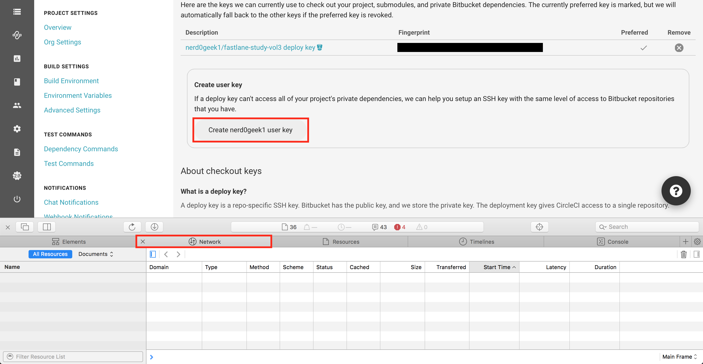

ネットワークタブから、`checkout-key`を選択し、生成されたuser keyの公開鍵をコピー
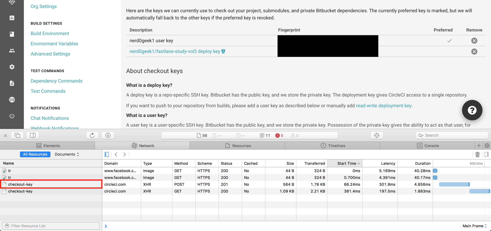

Bitbucketの設定画面へ遷移し、`SSH keys > Add Key`からコピーした公開鍵を登録
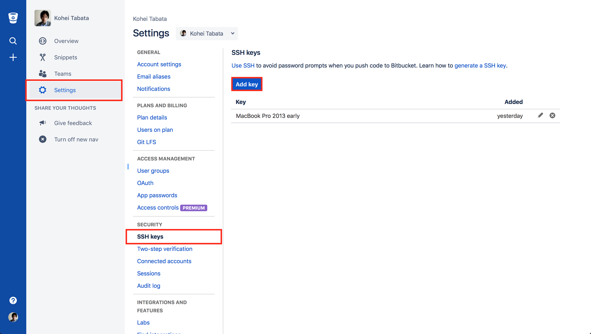

SSH Keysに公開鍵が登録されたことを確認
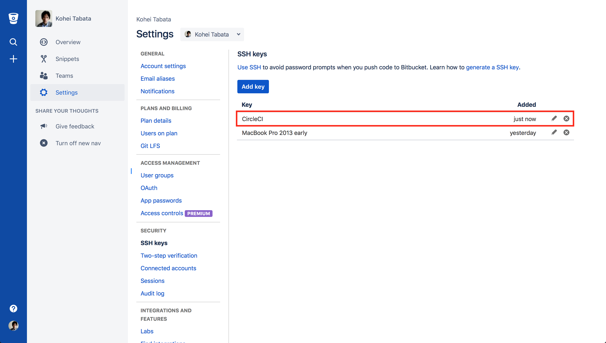

ここまで完了した段階でビルドを実行すると、CircleCI上で.ipaファイルが作成できるようになっていると思います。

## DeployGateでの配布
CircleCI上で.ipaファイルが作成できるようになったので、それをDeployGateで配布してみます。
Fastfileのbeta laneを以下のように編集します。  
(`DEPLOYGATE_API_TOKEN`、`DEPLOYGATE_USER`は環境変数として定義します)

```
platform :ios do
  desc "distribute latest app ipa via DeployGate"
  lane :beta do
    // AdHoc用の証明書、Provisioning Profileをダウンロード、インストール
    match(type: 'adhoc')
    // AdHoc用のipaファイルをビルド
    gym(export_method: 'ad-hoc')
    deploygate(api_token: DEPLOYGATE_API_TOKEN,
               user: DEPLOYGATE_USER,
               message: "fastlane study test message")
  end
end
```
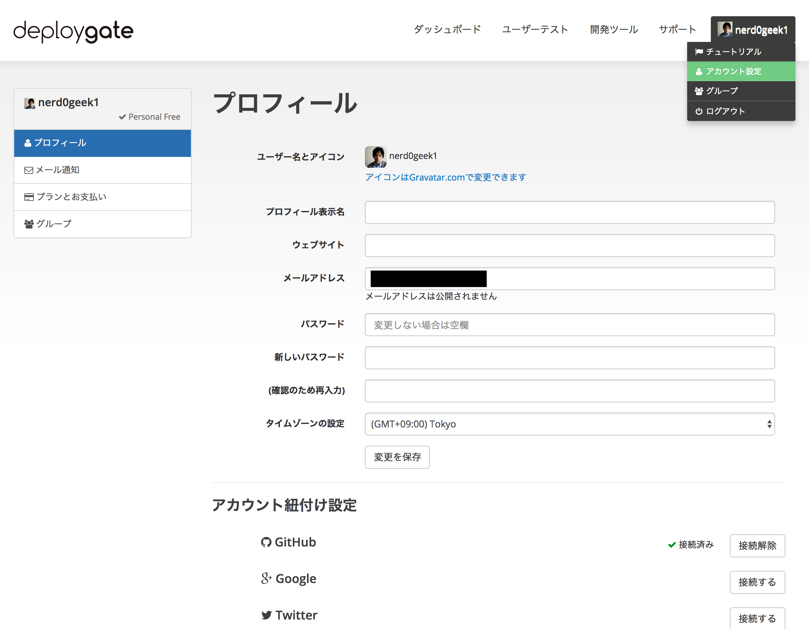
※ user, api_tokenはDeployGateのアカウント設定画面に表示されています。

これをpushし、CircleCIで実行することで、CircleCI上での自動ビルド&自動配布が実現できました。  
お疲れさまでした！

## 参考
- [nerd0geek1/fastlane-study-vol1 - GitHub](https://github.com/nerd0geek1/fastlane-study-vol1)
- [Test iOS applications on macOS - CircleCI](https://circleci.com/docs/1.0/ios-builds-on-os-x/)
- [Set up code signing for iOS projects - CircleCI](https://circleci.com/docs/1.0/ios-code-signing/)
- [Setting an SSH key for bitbucket - CircleCI discuss](https://discuss.circleci.com/t/setting-an-ssh-key-for-bitbucket/12829/10)
